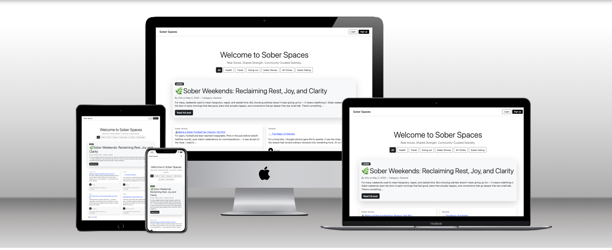
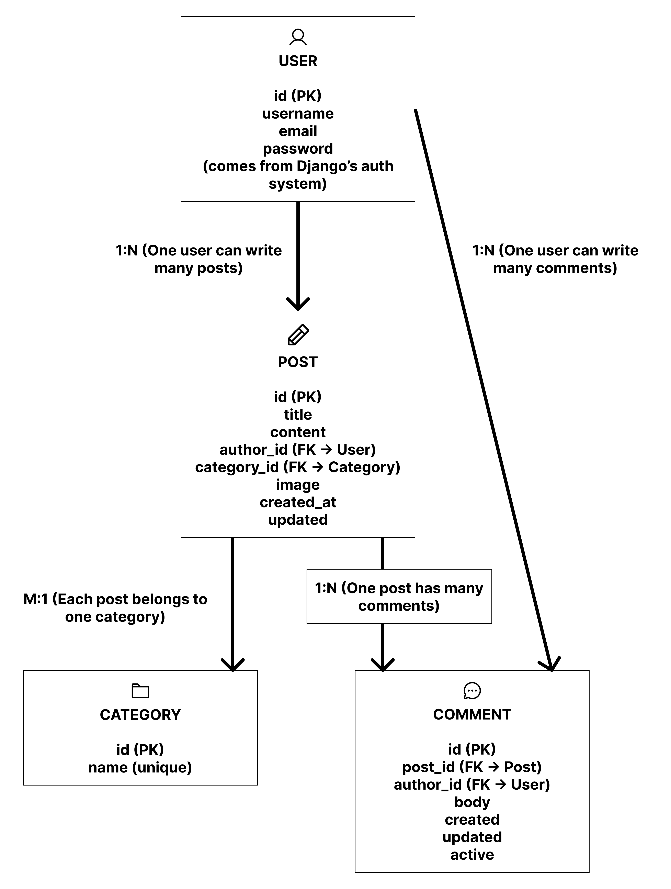
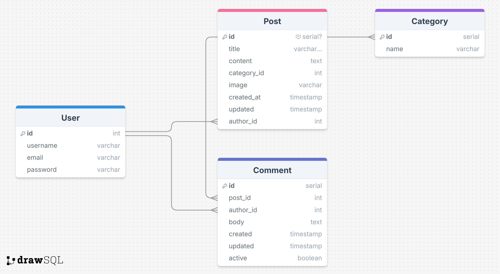
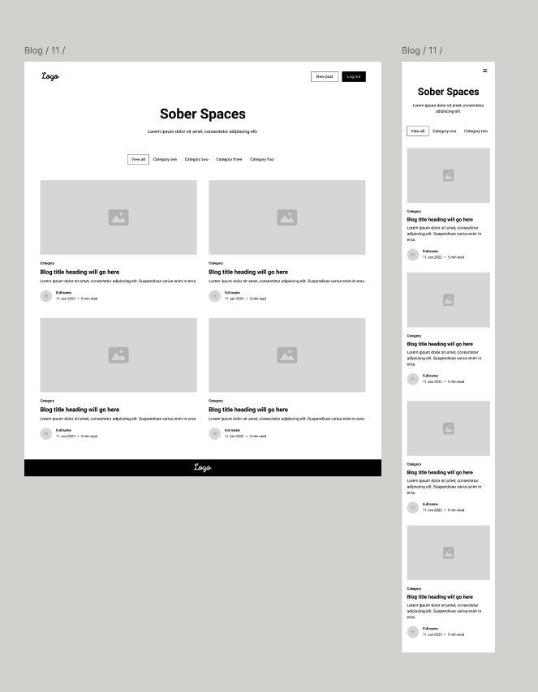
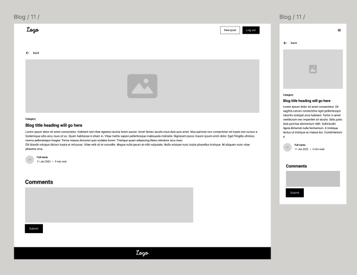

#  Sober Spaces – Django Blog Platform
---
**Sober Spaces** is a full-stack blog web application built using Django. It allows users to create, read, update and delete (CRUD) posts about sobriety journeys and alcohol-free venues. This project was developed as part of the Level 5 Diploma in Web Application Development, Unit 3: Back End Development.

---
## Live Site

This project is deployed on Heroku and can be accessed here:

[View the Live Site: Sober Spaces](https://ms3-blog-17789f37c9f8.herokuapp.com/)

## Admin Panel Access

This Django application includes an admin panel for managing posts, categories, and user comments.

You can access the admin interface here:

[Admin Panel](https://ms3-blog-17789f37c9f8.herokuapp.com/admin/login/?next=/admin/)

### Superuser Credentials (for testing)

These credentials are only for project assessment and testing purposes.

- **Username:** `sarashipley`
- **Password:** `123`

## Table of Contents

- [Purpose & Target Audience](#purpose--target-audience)
- [User Stories](#user-stories)
- [Features](#features)
- [Project Management and Agile Delivery](#project-management-and-agile-delivery)
- [Database Schema](#database-schema)
- [Entity Relationship Diagram](#entity-relationship-diagram-erd)
- [UX & Accessibility Design](#ux--accessibility-design)
- [Data Model](#data-model)
- [Validation & Accessibility Testing](#validation--accessibility-testing)
- [Future Improvements](#future-improvements)
- [Code Quality and Development Standards](#code-quality-and-development-standards)
- [Manual Testing and Bug Report](#manual-testing-and-bug-report)
- [Technologies Used](#technologies-used)
- [Deployment](#deployment)
- [Security](#security)
- [Custom Error Page](#custom-error-page)
- [Lessons Learned](#lessons-learned)
- [Acknowledgements](#acknowledgements)

---

## Purpose & Target Audience

This project serves a community of users who are interested in living alcohol-free lifestyles and wish to share experiences, recommend venues, and find inspiration through blog content. It’s designed to be simple, intuitive and accessible.

---

## User Stories

**As a visitor, I want to:**

- Browse recent blog posts  
- Filter posts by category  
- Read inspiring stories from others  
- View featured content  

**As a registered user, I want to:**

- Sign up and log in securely  
- Create new blog posts  
- Edit or delete my own posts  
- See feedback when my actions succeed or fail  

**As an admin, I want to:**

- View and delete comments from admin panel if nessesary
- Manage categories from the admin panel  
- Ensure platform security and data integrity  

---

## Features

- User registration & login/logout (Django Allauth)  
- Create, edit & delete posts (authenticated users only)  
- Categorised post filtering  
- Featured "latest" post highlighted at the top  
- Comment system 
- Pagination for performance and UX  
- Responsive layout with Bootstrap 5.3  
- Custom CSS theme (clean, accessible, and consistent)  
- Deployed to Heroku with PostgreSQL database  

---

## Project Management and Agile Delivery

Project planning and task tracking were managed using the GitHub Projects board. The board was structured using columns **To Do**, **In Progress**, and **Done** to organise tasks effectively and ensure steady progress throughout development.

Each issue or task was broken down into manageable items, including UI design, CRUD functionality, testing, and deployment.

## Entity Relationship Diagram (ERD)

The ERD was especially useful in:
- Identifying how posts and comments are tied to users
- Structuring the `Post` model with foreign keys to both `User` and `Category`
- Clarifying the 1-to-many relationships between `User → Post`, `User → Comment`, and `Post → Comment`
- Removing unnecessary complexity (e.g., a custom `Profile` model)

The diagram below illustrates the final data structure used in the app:

## Database Schema

The diagram below shows how the main parts of the website's data are connected. Each blog post is written by a registered user and can belong to a category (like "Health" or “Travel”). Users can also leave comments on posts. Each comment is linked both to the post it’s about and to the user who wrote it. This structure keeps everything organised and makes it easy to manage content and users within the site.

## UX & Accessibility Design

- Built with UX principles: clear navigation, visible feedback, and form validation  
- Follows accessibility standards: readable fonts, clear contrast, semantic HTML  
- Fully responsive (mobile-first)  
- Navigation supports keyboard and screen readers  
- Feedback messages on key actions (e.g. post created, login failed)  

## Figma Wireframes
Early-stage wireframes were created in Figma to plan layout, structure, and user flow before development began. These helped define a clean, responsive design aligned with UX principles and guided the placement of key features like navigation, post layout, and form interactions.

**Post List**

**Post Detail**

---

## Data Model

### Post

| Field      | Type          | Notes                    |
|------------|---------------|--------------------------|
| title      | CharField     | Required, max_length=100 |
| content    | TextField     | Required                 |
| author     | FK → User     | Required                 |
| category   | FK → Category | Optional                 |
| created_at | DateTimeField | auto_now_add             |
| updated    | DateTimeField | auto_now                 |

### Category

| Field | Type      | Notes            |
|-------|-----------|------------------|
| name  | CharField | Required, unique |

### Comment

| Field   | Type         | Notes                      |
|---------|--------------|----------------------------|
| post    | FK → Post    | Required                   |
| author  | FK → User    | Required (linked to user)  |
| body    | TextField    | Required                   |
| created | DateTime     | Auto-generated             |
| updated | DateTime     | Auto-updated               |
| active  | BooleanField | Used for moderation        |

---

## Manual Testing and Bug Report

**Read [BUG REPORT](debugging.md) here**

| Test Case                    | Expected Outcome                               | Result   |
|-----------------------------|------------------------------------------------|----------|
| Register new user           | Redirects with success message                 | ✅ Pass  |
| Login                       | Authenticated user name shown                  | ✅ Pass  |
| Create/Edit/Delete post     | Data updates appear correctly on frontend      | ✅ Pass  |
| Post pagination             | Older posts accessible                         | ✅ Pass  |
| Filter by category          | Filter works as expected                       | ✅ Pass  |
| Commenting                  | Comments added with CRUD                       | ✅ Pass  |
| Responsive layout           | Works on mobile, tablet, desktop               | ✅ Pass  |
| 404 pages                   | Custom error page loads                        | ✅ Pass  |
| Static files                | CSS load correctly                             | ✅ Pass  |

---

## Technologies Used

- Python 3.13  
- Django 4.2  
- PostgreSQL  
- Heroku  
- Bootstrap 5.3  
- Django Allauth  
- HTML5, CSS3  

---

## Deployment

**Deployed on Heroku**

### Steps:

1. Set up PostgreSQL on Heroku  
2. Added environment variables  
3. Installed production dependencies: Gunicorn, Psycopg2  
4. Ran `python manage.py collectstatic`  
5. Connected Heroku to GitHub for auto-deploy  

---

## Security

-   Secrets such as the `SECRET_KEY` and `DATABASE_URL` are stored in a `.env` file and are excluded from version control

-   `DEBUG = False` is set for the production environment

-   `ALLOWED_HOSTS` are configured to limit access only to the live app and localhost

-   Admin panel access is restricted to superusers only

-   User authentication is required to create, edit, or delete posts or comments

---

## Custom Error Page

The application includes a custom 404.html error page to guide users when they navigate to a non-existent page. This page is designed to work reliably in production when DEBUG = False, avoiding the default Django error screen.

Additional error templates (403, 500) could be added in future to extend user guidance during permission or server issues.

---

## Code Quality and Development Standards

This project was developed using clean, maintainable, and professional coding practices throughout.

- **PEP8 Compliance:** All Python code adheres to the PEP8 style guide for readability and consistency  
- **Validated Markup:** HTML and CSS were validated using the [W3C](https://validator.w3.org/) and [Jigsaw](https://jigsaw.w3.org/css-validator/) tools  
- **Version Control:** Git was used throughout development, with clear and descriptive commit messages
- **Consistent Naming:** All files, variables, and functions use consistent, meaningful names; filenames are lowercase and use no spaces for cross-platform compatibility  
- **Clear Structure:** Templates, static files, and media are organised by type; custom code is separated from third-party libraries  
- **Readable Code:** Code is cleanly indented, commented where necessary, and split into logical sections for ease of understanding  
- **Semantic HTML:** HTML structure uses semantic tags to support accessibility and screen readers  
- **Defensive Design:** Backend validation is used on all forms, authentication is enforced for sensitive actions, and custom error pages provide a graceful fallback for users  
- **Robust Logic:** Input and upload errors are handled gracefully; logic errors were manually tested and addressed throughout development  

These practices ensure the application is not only functional but also scalable, accessible, and easy to maintain for future development.

---

##  Validation & Accessibility Testing

**Read the [TESTING REPORT](testing.md) here.**

- **HTML Validation**: All HTML templates were passed through [W3C Validator](https://validator.w3.org/) and fixed for any structural issues.
- **CSS Validation**: Stylesheets were tested using [Jigsaw CSS Validator](https://jigsaw.w3.org/css-validator/) with no major warnings.
- **Python Code Quality**: Code conforms to [PEP8](https://peps.python.org/pep-0008/) using `flake8` and VSCode extensions. 
- **Lighthouse Testing**:
  - **Performance**: 97
  - **Accessibility**: 100
  - **Best Practices**: 100
  - **SEO**: 100
- **Keyboard Navigation**: Key site interactions (e.g., forms, buttons, navigation) were tested using Tab and Enter keys and function as expected.
- **Screen Reader Compatibility**: VoiceOver testing on Mac confirmed that headings, buttons, and content are accessible using semantic HTML structure.
- **ARIA Labels**: Semantic markup was prioritised, and no custom ARIA roles were required in this build.

---

## Future Improvements

**Comment Moderation**

Comment moderation was considered during development to allow admin approval before displaying user-submitted comments. However, to streamline the user experience and simplify testing, moderation was omitted in the current version. Comments are displayed immediately upon submission.

This decision allowed for a clearer focus on core CRUD functionality and user interaction. If time permits, moderation may be reintroduced as an enhancement by enabling the existing `active` field and filtering comments accordingly.

Similarly, image upload functionality was intentionally removed to simplify the final project scope. However, the structure of the Post model and templates can easily accommodate image support in future iterations, making it easy to add this enhancement once the core application has been assessed.

---

##  Lessons Learned

Throughout this project, I learned how to work with Django's full-stack architecture in a real-world setting and how to debug and resolve issues confidently.

Some key lessons include:

-   **Model changes require planning**: Adding an `author` field to the `Post` model after posts were already created caused migration errors. I learned how to handle this by applying default values and understanding how migrations interact with existing data.

-   **User permissions are essential**: When the `Edit` and `Delete` buttons weren't showing, I used template conditions and testing techniques to verify whether the logged-in user matched the post author. This deepened my understanding of how to securely manage content ownership.

-   **Templates need error handling**: Forms that silently failed on submission taught me to always include `{{ form.non_field_errors }}` and field-level error displays. This ensured users got proper feedback and improved the overall UX.

-   **Avoiding duplicate code matters**: A bug caused by a duplicate `post_list` function reminded me that clean, non-redundant views and careful file organisation are just as important as writing correct logic.

-   **Email authentication can be simplified**: To streamline the signup process for assessment, I disabled email verification and removed email fields entirely. This helped avoid issues with Allauth and allowed for smoother testing without an email server.

-   **POST/Redirect/GET is best practice**: Submitting comments originally kept the comment in the form field due to a missing redirect. I fixed this using the PRG pattern, which cleared the form and prevented duplicates on refresh.

-   **Image fields added complexity**: I originally allowed image uploads for posts, but during Lighthouse testing I found they were negatively affecting performance and accessibility. I decided to remove them altogether to simplify the project and ensure better scores. If I had tested earlier, I would have avoided spending time styling and debugging image display unnecessarily.

---

##  Acknowledgements

- Django Docs  
- Bootstrap Docs  
- Cloudinary Docs  
- Code Institute examples and course materials for gudiance and inspiration  
- Blog post content generated by AI
- Drawsql was used for database schema
- Matt Rudge youtube tutorials for a guidance
- Special thanks to my mentor Spencer Bariball for this help and advice on this project
