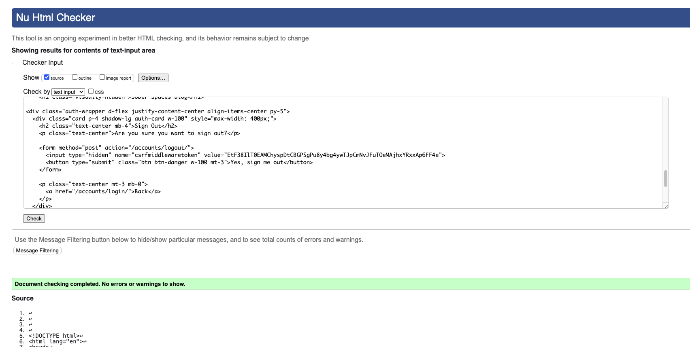
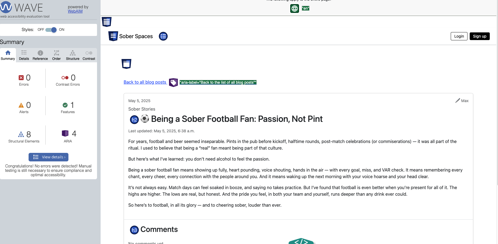

## Code Validation

All HTML files were tested using the [W3C Markup Validator](https://validator.w3.org/). All minor structural HTML errors were corrected.

<strong>✔ post_list.html</strong> – Passed

**Status:** ✅ Pass

<strong>✔ post_detail.html</strong> – Passed

**Notes:**
- No structural errors.
- All tags properly closed and nested.

**Status:** ✅ Pass

<strong>✔ logout.html</strong> – Passed

**Notes:**
- All content properly structured.
- Page passed validation cleanly.

**Status:** ✅ Pass

<strong>✔ logout_success.html</strong> – Passed

**Status:** ✅ Pass

<strong>✔ post_confirm_delete.html</strong> – Passed

**Notes:**
- Form markup validated successfully.
- Required fields are correctly labelled and accessible.

**Status:** ✅ Pass

>

<strong>✔ login.html</strong> – Passed

**Notes:**
- Form markup validated successfully.
- Required fields are correctly labelled and accessible.

**Status:** ✅ Pass

>

---

<strong> CSS Validation</strong> – Passed

All custom CSS was tested using the [W3C CSS Validator](https://jigsaw.w3.org/css-validator/) to ensure compliance with modern web standards.

The main stylesheet (`style.css`) was uploaded directly to the validator. The results showed no syntax errors or compatibility warnings.

**Status:** ✅ Pass

---

### PEP 8 Compliance

All Python files were checked for PEP 8 compliance using the [PEP8 CI tool](https://pep8ci.herokuapp.com/).  
Warnings and errors were resolved where appropriate to ensure code quality and readability.

---
## Accessibility 

This site was tested using the WAVE Web Accessibility Evaluation Tool to help ensure it is usable by as many people as possible, including those using screen readers or keyboard navigation.

All critical issues were resolved, including:

- Making sure every image has alt text
- Ensuring that every page has a proper heading structure (with one main heading)
- Removing empty heading tags that were confusing for screen readers
- Adding descriptive link text (like “Read more about this post”) where needed
- Including a hidden heading in the site’s layout to support screen readers
- **Redundant Links**: WAVE flagged multiple links pointing to the same destination within each blog card — for example, both the post title and a "Read more" button linking to the full post. While this is a common and user-friendly design pattern, it was reviewed for accessibility. To reduce potential confusion for screen reader users, one of the duplicate links was removed, leaving a single clear and descriptive link per card.
- **Low Contrast Buttons**: WAVE identified that the original "Edit" and "Delete" comment buttons had low contrast due to Bootstrap's `outline` button styles. These were updated to solid `btn-secondary` and `btn-danger` styles with white text to ensure they are readable and accessible to all users.

Some common blog patterns, like linking both the post title and a “Read more” button to the same page, were kept for usability but reviewed to make sure they didn’t cause confusion.

The site now passes accessibility checks and offers a user-friendly experience across devices and assistive technologies.

<strong>View WAVE Accessibility Homepage Screenshots</strong>

<strong>View WAVE Accessibility Post Detail Page Screenshots</strong>

<strong>View WAVE Accessibility Create Post Page Screenshots</strong>

<strong>View WAVE Accessibility Sign Out Page Screenshots</strong>

<strong>View WAVE Accessibility Login Page Screenshots</strong>

---
 ⚠️ One alert flagged for "Redundant Links" on the login page. This occurred because both the navbar and login form contain a link to the signup page.
  
This is an intentional design decision to offer users multiple clear paths to registration, especially for mobile or first-time visitors and does not affect usability or accessibility.

---

<strong>View WAVE Accessibility 404 Page Screenshots</strong>

---

## Lighthouse Audit Results (Chrome DevTools)

<strong>View Lighthouse Test Screenshots</strong>

_Add screenshots here showing Lighthouse scores and reports for homepage and post pages._

Lighthouse was run on the live site using Chrome DevTools to assess accessibility, performance, SEO, and best practices. Results were consistent across multiple key pages.

| Metric        | Score Range (Out of 100) | Notes                                                         |
|---------------|--------------------------|---------------------------------------------------------------|
| Accessibility | 95–100                   | Strong use of alt text, labels, proper landmarks, and heading order. |
| Performance   | 90–100                   | Optimised images, lazy loading, and minimal unused JS/CSS.    |
| SEO           | 100                      | All pages include meta titles, descriptions, and semantic HTML. |
| Best Practices| 100                      | Site uses HTTPS, avoids deprecated APIs, and passes audits.   |
---
###  Performance Optimisation: Removal of Post Images

To improve Lighthouse performance scores and ensure a faster, more accessible user experience, post images were removed from the blog listing page (`post_list.html`).

#### Reason for Removal

During testing, including images on every post caused several issues:

-  Lower Lighthouse Performance Scores (sometimes as low as 65)
-  Slower Largest Contentful Paint (LCP)
-  Increased total network payload
-  Higher Cumulative Layout Shift (CLS)
- Layout inconsistencies on mobile devices

Even with lazy loading and Cloudinary optimisations, these image-heavy layouts significantly impacted performance.

#### Result After Removal

- ✅ Lighthouse score improved to 96+ for Performance
- ✅ CLS dropped close to 0
- ✅ Page load time visibly improved on slow connections
- ✅ Better consistency and layout stability across screen sizes

Removing images was a tradeoff for performance and user experience. A clean, minimal layout was prioritized for clarity and readability, especially on mobile devices.

---
